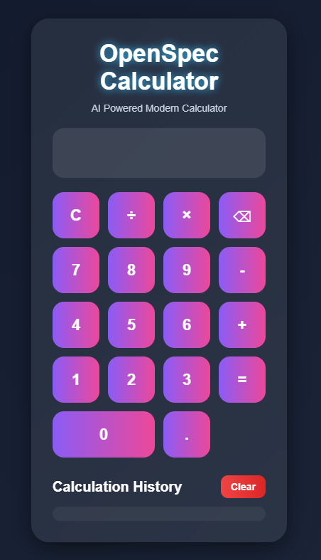
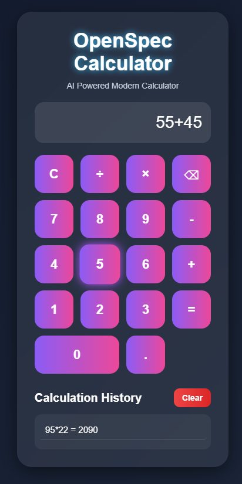
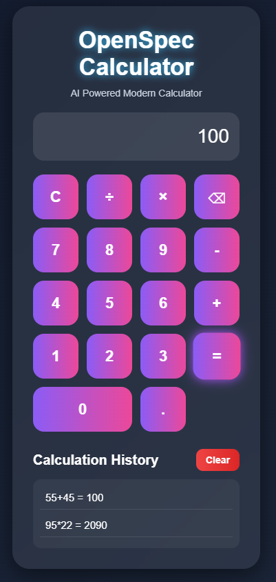

# OpenSpec Calculator

## Workflow Type

This branch demonstrates Spec Driven Development (SDD) using YAML specifications, architecture planning, and documentation-first workflow.

---

## Features

- Modern Glassmorphism UI
- Clickable Calculator Buttons
- Keyboard Support
- Addition
- Subtraction
- Multiplication
- Division
- Responsive Design
- Calculation History
- Clear History Feature

---

## Development Methodology

This branch follows specification-first development where architecture and feature requirements are defined before implementation.

---

## Tech Stack

- Python
- Flask
- HTML
- CSS
- JavaScript
- YAML

---

## Screenshots

### Main Calculator UI



---

### Calculator Working



---

### History Feature



---

## Project Structure

```text
calculator-python-app/
│
├── docs/
│   └── architecture.md
│
├── prompts/
│   └── sdd_workflow.md
│
├── screenshots/
│   ├── calculator-ui_01.png
│   ├── calculator-ui_02.png
│   └── calculator-ui_03.png
│
├── specs/
│   ├── calculator_spec.yaml
│   └── ui_spec.yaml
│
├── static/
│   └── style.css
│
├── templates/
│   └── index.html
│
├── .gitignore
├── Procfile
├── app.py
├── README.md
└── requirements.txt
```

---

## SDD Workflow

1. Define project requirements
2. Create YAML specifications
3. Design architecture
4. Implement Flask application
5. Test calculator workflow
6. Improve UI and responsiveness

---

## Installation

```bash
pip install -r requirements.txt
python app.py
```

---

## Specifications

### calculator_spec.yaml

Defines:
- Calculator operations
- Backend configuration
- Feature requirements

### ui_spec.yaml

Defines:
- UI layout
- Interaction behavior
- Responsive styling
- User experience features

---
