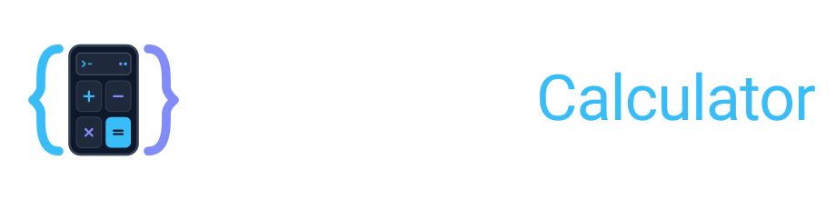
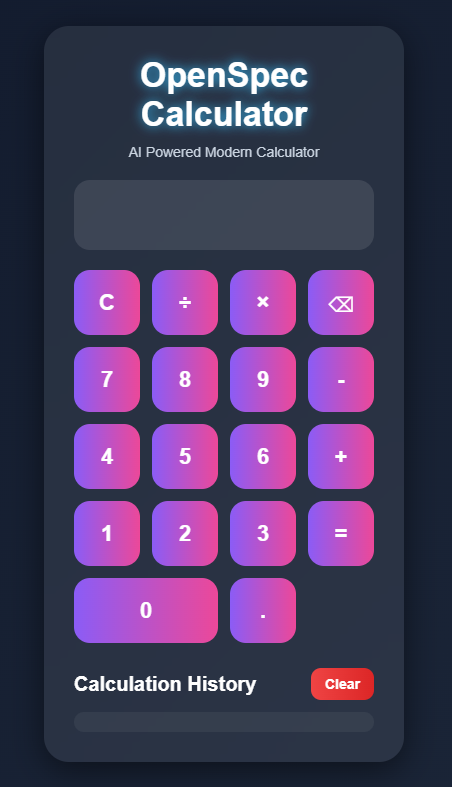
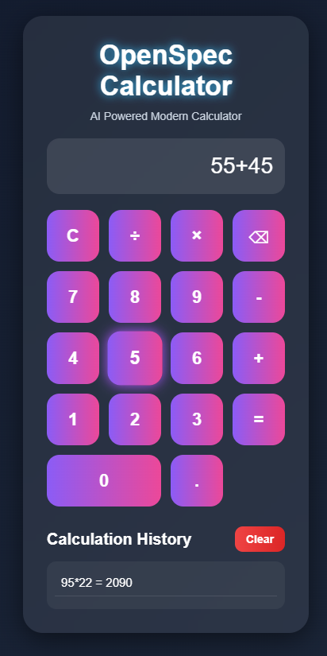
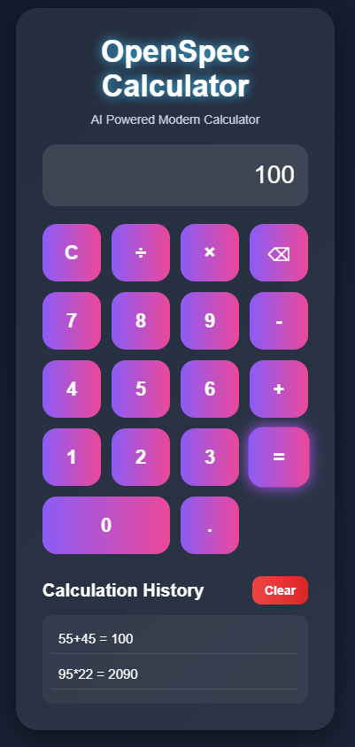

<div align="center">
  
  <p>A modern, specification-driven web calculator built with Flask.</p>
</div>

---

## Live Demo

🌐 **[OpenSpec Calculator](https://calculator-python-app-three.vercel.app/)**

---

## Brand Identity

OpenSpec Calculator combines specification-driven development concepts with a computational interface. The logo uses specification brackets and calculator operators to represent structured specifications and computation.

---

## Features

- **Core Arithmetic**: Addition (`+`), subtraction (`−`), multiplication (`×`), and division (`/`)
- **Decimal Support**: Precision calculations with decimal values
- **Display Controls**: Clear all (`C`) and single-character backspace (`⌫`)
- **Calculation History**: Persistent session log of past operations with a clear-history option
- **Keyboard Navigation**: Full keyboard input support (number keys, arithmetic operators, Enter, Backspace, Escape)
- **Audio Feedback**: Subtle auditory clicks on button interaction
- **Modern Interface**: Glassmorphism dark-theme styling with responsive mobile support

---

## Tech Stack

- Python
- Flask
- Jinja2
- HTML
- CSS
- JavaScript
- Vercel

---

## Screenshots

### Main Calculator UI


### Active Calculation


### History Feature


---

## Project Structure

```text
calculator-python-app/
│
├── docs/
│   └── architecture.md
│
├── prompts/
│   └── vibe_prompt.md
│
├── screenshots/
│   ├── calculator-ui_01.png
│   ├── calculator-ui_02.png
│   └── calculator-ui_03.png
│
├── specs/
│   ├── calculator_spec.yaml
│   └── ui_spec.yaml
│
├── static/
│   ├── logo/
│   │   ├── openspec-horizontal-darkbg.png
│   │   ├── openspec-horizontal.png
│   │   ├── openspec-horizontal.svg
│   │   ├── openspec-icon-darkbg.png
│   │   ├── openspec-icon.png
│   │   └── openspec-icon.svg
│   └── style.css
│
├── templates/
│   └── index.html
│
├── .gitignore
├── Procfile
├── app.py
├── README.md
└── requirements.txt
```

---

## Getting Started

### Prerequisites

- Python 3.8+
- pip

### Installation

1. Clone the repository:
   ```bash
   git clone https://github.com/mrashish18/calculator-python-app.git
   cd calculator-python-app
   ```

2. Install dependencies:
   ```bash
   pip install -r requirements.txt
   ```

3. Run the development server:
   ```bash
   python app.py
   ```

4. Open your browser and navigate to the application address shown in your terminal.
